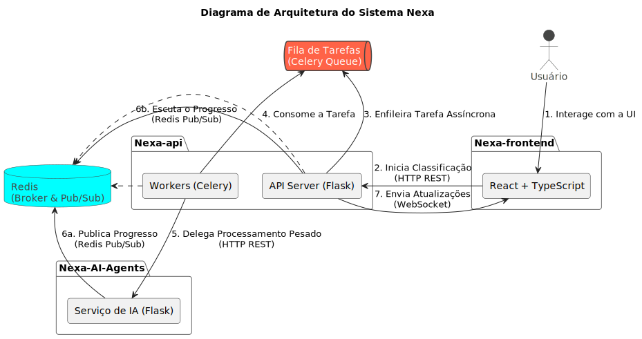
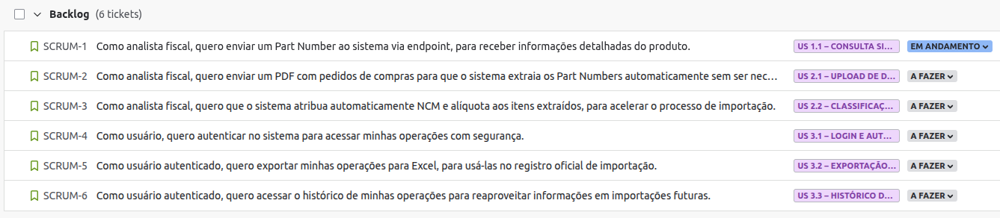

# NEXA
**Agente de Inteligência Artificial para instrução de Processo para Registro de Importação**

> Status do Projeto: Em andamento ... 
<!-- >
> Relatório de Testes: [PDF](docs/cliente/relatorio_avaliacoes.pdf) 📊
>
> Pasta de Documentação: [Link](docs/) 📄
> 
> Video do Projeto:  [Youtube](https://youtu.be/) 📽️ -->

## Desafio
Desenvolvimento de um agente de Inteligência Artificial capaz de elaborar a instrução de registro aduaneiro com as informações pertinentes do material que relacione: Part-Number, classificação fiscal, fabricante, origem do fabricante com endereço completo, gerando a informação da descrição do material, de forma que permita a receita federal entender o que é o produto e não gere dúvidas sobre o item o e não acarrete penalidades e/ou multas sobre o material declarado.

## Arquitetura
Arquitetura orientada a eventos e altamente desacoplada, mantendo foco em experiência do usuário, confiabilidade e integração transparente com IA.

Para detalhes da implementação: [Documento da Arquitetura](architecture.md)

## 🛠️ Tecnologias Utilizadas

  
  
  
  
  
  
  
  <!--  -->

  
  
  
  
  
  
  

  
  
  
  

## ⚡ Desenvolvimento Ágil
O projeto foi feito seguindo o método Ágil SCRUM, dividindo o trabalho em sprints de 21 dias, com reuniões diáras, revisões e retrospectivas ao final.

### 📋 Backlog do Produto

### Roadmap

### 📅 Cronograma
| Sprint            | Prazo      | Status       | Documentação | Entrega |
| ----------------- | ---------- | ------------ | ------------ | ------- |
| Kick Off          | 25/08/2025 | Concluído    | -            | -       |
| Sprint 1          | 28/09/2025 | Concluído    |
| Sprint 2          | 26/10/2025 | Em andamento |
| Sprint 3          | 23/11/2025 | Pendente     |
| Feira de Soluções | 04/12/2025 | Pendente     |

## Manual de Instalação e Execução

## 🎓 Equipe 

  <table>
    <tr>
      <th>Membro</th>
      <th>Função</th>
      <th>Github</th>
      <th>Linkedin</th>
    </tr>
    <tr>
      <td>Agatha Wei</td>
      <td>Product Owner</td>
      <td>
        
      </td>
      <td>
        
      </td>
    </tr>
    <tr>
      <td>Julia Soares</td>
      <td>Scrum Master</td>
      <td>
        
      </td>
      <td>
        
      </td>
    </tr>
    <tr>
      <td>Eduardo Ribeiro</td>
      <td>Dev Team</td>
      <td>
        
      </td>
      <td>
        
      </td>
    </tr>
    <tr>
      <td>Pedro Garcia</td>
      <td>Dev Team</td>
      <td>
        
      </td>
      <td>
        
      </td>
    </tr>
    <tr>
      <td>Wesley Gonçalves</td>
      <td>Dev Team</td>
      <td>
        
      </td>
      <td>
        
      </td>
    </tr>
  </table>

