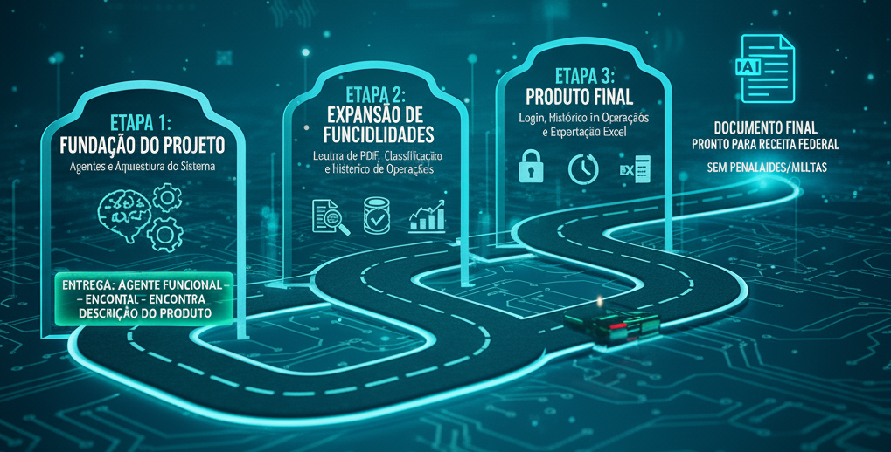
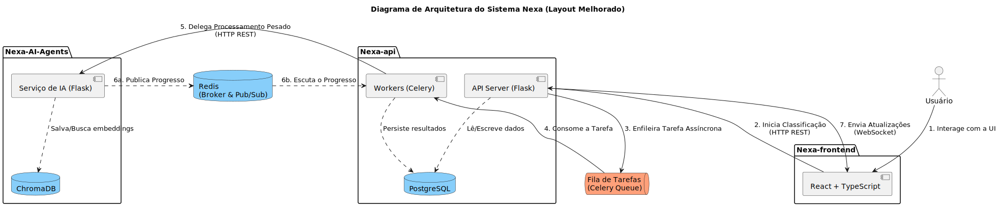

# NEXA

**Agente de Inteligência Artificial para instrução de Processo para Registro de Importação**


> **Status do Projeto: Concluído (Entregue e  em evolução contínua)**

## Desafio

Desenvolvimento de um agente de Inteligência Artificial capaz de elaborar a instrução de registro aduaneiro com as informações pertinentes do material que relacione: Part-Number, classificação fiscal, fabricante, origem do fabricante com endereço completo, gerando a informação da descrição do material, de forma que permita a receita federal entender o que é o produto e não gere dúvidas sobre o item o e não acarrete penalidades e/ou multas sobre o material declarado.

## ⚡ Desenvolvimento Ágil

O projeto foi feito seguindo o método Ágil SCRUM, dividindo o trabalho em sprints de 21 dias, com reuniões diáras, revisões e retrospectivas ao final.

### 📋 Backlog do Produto

| Sprint | User Story | Status | Prioridade |
| :---  | :--- | :--- | :--- |
| **1** | Como analista fiscal, quero enviar um Partnumber ao sistema para receber informações detalhadas do produto. | CONCLUÍDA | ▲ Alta |
| **2** | Como analista fiscal, quero enviar um PDF com pedidos de compras para que o sistema extraia os Part Numbers automaticamente... | CONCLUÍDA | ▲ Alta |
| **2** | Como analista fiscal, quero que o sistema atribua automaticamente NCM e alíquota aos itens extraídos, para acelerar o processo de importação. | CONCLUÍDA | ▲ Alta |
| **2** | Como usuário, quero acessar o status da minha requisição de classificação | CONCLUÍDA | **=** Média |
| **3** | Como usuário, quero autenticar no sistema para acessar minhas operações com segurança. | CONCLUÍDA | ▲ Alta |
| **3** | Como usuário autenticado, quero exportar minhas operações para Excel, para usá-las no registro oficial de importação. | CONCLUÍDA | **=** Média |
| **3** | Como usuário autenticado, quero acessar o histórico de minhas operações para reaproveitar informações em importações futuras. | CONCLUÍDA | **=** Média |

### 📅 Cronograma

| Sprint            | Prazo      | Status       | Documentação           | Entrega |
| ----------------- | ---------- | ------------ | ---------------------- | ------- |
| Kick Off          | 25/08/2025 | Concluído    | -                      | -       |
| Sprint 1          | 28/09/2025 | Concluído    | [sprint1](sprint_1.md) | [video](https://youtu.be/jFSbepQdjow)       |
| Sprint 2          | 26/10/2025 | Concluído | [sprint2](sprint_2.md) | [video](https://youtu.be/kPAlwLgL88o)       |
| Sprint 3          | 23/11/2025 | Concluído     | [sprint3](sprint_3.md) | -       |
| Feira de Soluções | 04/12/2025 | Não iniciado     | [feira](feira_sol.md)  | -       |

### Roadmap



### 👥 Fatec São José dos Campos - Prof. Jessen Vidal

| Cliente          | Período/Curso                                  | Professor M2      | Professora P2     | Contato Cliente                    |
| ---------------- | ---------------------------------------------- | ----------------- | ---------------- | ---------------------------------- |
| Creonice Honório - Empresa TecSys | 4º Análise e Desenvolvimento de Sistemas | Giuliano Bertoti  | Juliana Pasquini | <creonice@tecsysbrasil.com.br> |

## Documentação Técnica

Arquitetura orientada a eventos e altamente desacoplada, mantendo foco em experiência do usuário, confiabilidade e integração transparente com IA. . Cada componente possui responsabilidades bem definidas e se comunica através de APIs REST, WebSockets e um broker de mensagens via Redis, conforme detalhado nos documentos de arquitetura.

## Arquitetura


Para detalhes da implementação: [Documento da Arquitetura](architecture.md)

Abaixo você encontra os links para a documentação específica de cada serviço.

-----

### 🔹 [Nexa API](https://github.com/Titus-System/Nexa-api)

O `Nexa-api` é o **orquestrador central** da aplicação. Construído em Python com Flask, ele atua como o API Gateway, gerenciando todas as requisições do cliente, a lógica de negócio principal e a comunicação assíncrona com os outros serviços.

**Principais Responsabilidades:**

- **Endpoints REST:** Expõe os endpoints para o frontend, incluindo `/upload-pdf` para o envio de documentos e `/classify-partnumber` para classificações individuais.
- **Orquestração Assíncrona:** Utiliza **Celery** e **Redis** para enfileirar tarefas pesadas (como o parsing de PDFs e as chamadas para a IA), mantendo a API sempre responsiva.
- **Comunicação em Tempo Real:** Gerencia a comunicação via **WebSocket (Socket.IO)** com o frontend para enviar atualizações de progresso em tempo real.
- **Persistência de Dados:** É o único serviço com responsabilidade de escrita no **banco de dados relacional (PostgreSQL)**, onde armazena os resultados finais das classificações.
- **Validação e Segurança:** Valida os dados de entrada (usando Pydantic) e lida com a lógica de autenticação e autorização de usuários.

**Tecnologias-chave:** `Python`, `Flask`, `Celery`, `Redis`, `Socket.IO`, `SQLAlchemy`, `Docker`.

-----

### 🧠 [Nexa AI Agents](https://github.com/Titus-System/Nexa-AI-Agents/)

O `Nexa-AI-Agents` é o **cérebro de IA** do sistema. Este serviço especializado, também em Python, é totalmente focado em executar as tarefas de inteligência artificial. Ele opera de forma independente, recebendo solicitações do `Nexa-api` e retornando resultados sem conhecer a lógica de negócio principal.

**Principais Responsabilidades:**

- **Processamento de IA:** Executa os modelos de linguagem para gerar descrições técnicas e classificar NCMs.
- **Retrieval-Augmented Generation (RAG):** Utiliza um **banco de dados vetorial (ChromaDB)** para buscar informações contextuais e semanticamente similares, aumentando a precisão e a qualidade das respostas geradas pela IA.
- **Publicação de Progresso:** Comunica-se de forma assíncrona com o `Nexa-api`, publicando atualizações de progresso em um canal **Redis (Pub/Sub)**.
- **Serviço Agnóstico:** Não possui estado e não se conecta diretamente a outros componentes, exceto o Redis e o ChromaDB, garantindo seu total desacoplamento.

**Tecnologias-chave:** `Python`, `Flask`, `Ollama`, `ChromaDB`, `Redis`, `smol-agents`, `Docker`.

-----

### 🖥️ [Nexa Frontend](https://github.com/Titus-System/Nexa-Frontend)

O `Nexa-frontend` é a **interface do cliente** da aplicação. Desenvolvida com React e TypeScript, esta Single-Page Application (SPA) foi projetada para oferecer uma experiência de usuário moderna, reativa e em tempo real.

**Principais Responsabilidades:**

- **Interação com o Usuário:** Fornece as telas para upload de documentos, entrada manual de Part Numbers e visualização de resultados.
- **Comunicação com a API:** Realiza chamadas para a `Nexa-api` via HTTP REST para iniciar os processos de classificação.
- **Atualizações em Tempo Real:** Estabelece uma conexão **WebSocket** com a API para receber e exibir o progresso das tarefas sem a necessidade de recarregar a página.
- **Gerenciamento de Estado:** Controla o estado da interface, garantindo que os dados exibidos sejam consistentes e atualizados.

**Tecnologias-chave:** `React`, `TypeScript`, `Vite`, `Socket.IO-client`, `CSS/Sass`, `Tailwind`.

## 🛠️ Tecnologias Utilizadas

<p align="center">
  
  
  
  
  
  
  
  
  

</p>

<p align="center">
  
  
  
  
  
  
  
</p>

<p align="center">
  
  
  
  
  
</p>

## Manual de Instalação e Execução

### 1. Pré-requisitos

- Python 3.11+ (para backend e IA)
- Servidor Ollama rodando o modelo `qwen2.5:14b`
- Node.js 18+ e npm (para frontend)
- Redis (pode ser local ou via Docker)
- Docker e Docker Compose (opcional, para facilitar a execução)

---

### 2. Clonando o Repositório

```bash
git clone https://github.com/Titus-System/Nexa.git
cd Nexa
```

---

### 3. Backend (Nexa-api)

```bash
cd Nexa-api
python -m venv venv
source venv/bin/activate
pip install --upgrade pip
pip install -r requirements.txt
cp .env.example .env
# Edite o .env conforme necessário
python run.py
```

**Ou Usando Docker Compose (opcional)**

```bash
cd Nexa-api
docker compose up -d --build
```

O backend estará disponível em [http://localhost:5000](http://localhost:5000).

---

### 4. IA/Agentes (Nexa-AI-Agents)

```bash
cd ../Nexa-AI-Agents
python -m venv venv
source venv/bin/activate
pip install -r requirements.txt
cp .env.example .env
# Edite o .env conforme necessário

docker compose up --build -d
# Rodar o banco de dados vetorial

python database/create.py
# Inicia o banco de dados vetorial

python run.py
```

O serviço estará disponível em [http://localhost:5001](http://localhost:5000).

---

### 5. Frontend (Nexa-frontend)

```bash
cd ../Nexa-frontend
npm install
npm run dev
```

O frontend estará disponível em [http://localhost:5173](http://localhost:5173).

---

### 7. Observações

- Certifique-se de que o Redis está rodando (`localhost:6379` por padrão).
- Ajuste as variáveis de ambiente nos arquivos `.env` de cada módulo conforme necessário.
- Para produção, utilize Gunicorn no backend e configure variáveis de ambiente seguras.

## 🎓 Equipe <a id="equipe"></a>

<div>
  <table>
    <tr>
      <th>Membro</th>
      <th>Função</th>
      <th>Github</th>
      <th>Linkedin</th>
    </tr>
    <tr>
      <td>Pedro Garcia</td>
      <td>Product Owner</td>
      <td>
        <a href="https://github.com/pedro-fs-garcia">
          
        </a>
      </td>
      <td>
        <a href="https://www.linkedin.com/in/pedro-fs-garcia">
            
        </a>
      </td>
    </tr>
    <tr>
      <td>Julia Soares</td>
      <td>Scrum Master</td>
      <td>
        <a href="https://github.com/juliasoares17">
          
        </a>
      </td>
      <td>
        <a href="www.linkedin.com/in/julia-soares-pereira-9ab79830b">
            
        </a>
      </td>
    </tr>
    <tr>
      <td>Eduardo Ribeiro</td>
      <td>Dev Team</td>
      <td>
        <a href="https://github.com/eduardo-Rib">
          
        </a>
      </td>
      <td>
        <a href="https://www.linkedin.com/in/eduardo-ribeiro-4b78002b2">
            
        </a>
      </td>
    </tr>
    <tr>
      <td>Wesley Gonçalves</td>
      <td>Dev Team</td>
      <td>
        <a href="https://github.com/WesleyGoncalves">
          
        </a>
      </td>
      <td>
        <a href="https://www.linkedin.com/in/wesley-d-goncalves/">
            
        </a>
      </td>
    </tr>
  </table>
</div>
