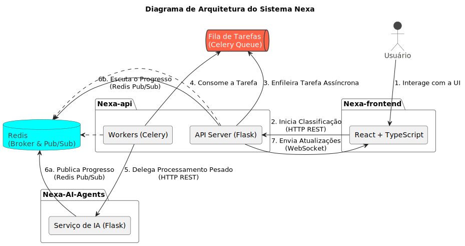

# Arquitetura do Sistema Nexa

## Visão Geral

O sistema Nexa é composto por três grandes módulos principais:

- **Nexa-frontend**: Interface web moderna, desenvolvida em React + TypeScript, responsável pela interação com o usuário.
- **Nexa-api**: Backend robusto em Python (Flask), que orquestra requisições, processamento assíncrono, integrações com IA e comunicação em tempo real.
- **Nexa-AI-Agents**: Serviço especializado para execução de tarefas de classificação com IA, também em Python, desacoplado do backend principal.

A comunicação entre os módulos é feita por HTTP REST, WebSocket (Socket.IO) e Redis Pub/Sub, garantindo flexibilidade, baixa latência e desacoplamento.

---

## Diagrama

---

## Nexa-frontend

- **Tecnologias**: React, TypeScript, Vite, Socket.IO-client.
- **Responsabilidades**:
	- Formulário para submissão de partnumbers e dados do produto.
	- Consome API REST para iniciar classificações.
	- Conecta-se via WebSocket para receber atualizações de progresso e resultado em tempo real.
	- Exibe notificações e status ao usuário.

---

## Nexa-api (Backend)

- **Tecnologias**: Python 3.11+, Flask, Flask-RESTful, Flask-SocketIO, Celery, Redis, Pydantic, Docker.
- **Responsabilidades**:
	- Recebe requisições REST do frontend para iniciar classificações.
	- Gera um `room_id` único para cada requisição, permitindo comunicação individualizada via WebSocket.
	- Orquestra tarefas assíncronas usando Celery, delegando o processamento pesado para o módulo Nexa-AI-Agents.
	- Utiliza Redis Pub/Sub para receber atualizações de progresso do processamento de IA.
	- Emite eventos de progresso e resultado final para o frontend via WebSocket (Socket.IO).
	- Possui injeção de dependências (Dependency Injector) para facilitar testes e manutenção.

**Fluxo resumido:**
1. Frontend faz POST para `/classify-partnumber`.
2. Backend valida, gera `room_id`, inicia tarefa Celery.
3. Celery faz POST para Nexa-AI-Agents, informando canal de progresso (Redis).
4. Backend escuta o canal de progresso no Redis, retransmite atualizações via WebSocket.
5. Ao final, resultado é enviado ao frontend.

---

## Nexa-AI-Agents

- **Tecnologias**: Python 3.10+, Flask, Pydantic, Redis, Ollama, smolagents.
- **Responsabilidades**:
	- Recebe requisições de classificação do backend via REST.
	- Executa o processamento de IA (pode usar modelos locais via Ollama).
	- Publica mensagens de progresso e resultado no canal Redis informado na requisição.
	- Não mantém estado de conexão com o backend, apenas publica no canal solicitado.

---

## Comunicação e Orquestração

### 1. Início da Classificação

- O frontend envia os dados do produto para o backend via REST.
- O backend inicia uma tarefa Celery, que faz uma requisição REST para o Nexa-AI-Agents, informando um canal Redis exclusivo para progresso.

### 2. Progresso Assíncrono

- Nexa-AI-Agents processa a tarefa e publica mensagens de progresso e resultado no canal Redis.
- O backend está inscrito nesse canal e retransmite cada atualização para o frontend via WebSocket.

### 3. Finalização

- Ao receber a mensagem de conclusão, o backend publica o resultado final no canal principal e encerra a inscrição no canal de progresso.

---

## Fluxo Principal de uma Requisição:
  1. O <b>Usuário</b> envia dados pelo <b>Frontend</b>.
  2. O <b>Frontend</b> faz uma requisição REST para a <b>API</b>.
  3. A <b>API</b> cria uma tarefa na fila <b>Celery</b> e responde imediatamente ao Frontend,
     que se conecta via <b>WebSocket</b> para aguardar os resultados.
  4. Um <b>Worker</b> ocioso consome a tarefa da fila.
  5. O <b>Worker</b> chama o serviço de <b>IA (Agents)</b>.
  6. Os <b>Agents</b> publicam atualizações de progresso no <b>Redis (Pub/Sub)</b>.
     A <b>API</b>, que está inscrita no canal, recebe essas atualizações.
  7. A <b>API</b> retransmite o progresso em tempo real para o <b>Frontend</b> via <b>WebSocket</b>.

---

## Tecnologias e Justificativas

- **Flask + Flask-RESTful + Flask-SocketIO**: Permite API REST e WebSocket no mesmo backend, simplificando a infraestrutura.
- **Celery + Redis**: Gerencia tarefas assíncronas e Pub/Sub, desacoplando processamento pesado do fluxo principal.
- **Pydantic**: Garante validação e tipagem robusta dos dados.
- **React + Vite**: Interface moderna, responsiva e de fácil manutenção.
- **Docker**: Facilita deploy e padronização de ambientes.

---

## Pontos Fortes da Arquitetura

- **Desacoplamento**: Processamento desacoplado e independente.
- **Baixa latência**: Feedback em tempo real via WebSocket.
- **Resiliência**: Falhas no processamento não bloqueiam o backend.
- **Evolução facilitada**: Componentes bem definidos e independentes.

---

## Resumo

O sistema Nexa adota uma arquitetura moderna, orientada a eventos e altamente desacoplada, mantendo foco em experiência do usuário, confiabilidade e integração transparente com IA.

---
